= Plan projektu
Szymon Kurpas <author@asciidoctor.org>
3.0, July 29, 2022: AsciiDoc article template
:icons: font

Projektem realizowanym przeze mnie będzie projekt nr. 12 o średnim poziomie trudności - kwadratowe ponumerowane puzzle, które należy ułożyć w kolejności rosnącej wierszami zgodnie z numerkami.

== Wykorzystane narzędzia i biblioteki

GUI aplikacji zostanie napisane z użyciem framework'a Qt.
Jeśli chodzi o IDE, to zostanie wykorzystany CLion.
Tam gdzie będzie to konieczne, wykorzystany zostanie QtCreator.
Kompilator: `clang`

== Funkcjonalności

=== Tworzenie nowej gry

- możliwość wyboru planszy spośród typów: numeryczne, obrazkowe
- możliwość wyboru rozmiaru planszy spośród predefiniowanych rozmiarów, ale także możliwość zdefiniowania własnego rozmiaru planszy
- możliwość wgrania własnego zdjęcia w celu zdefiniowania planszy z obrazkiem
- możliwość zapisu planszy, w celu późniejszego szybszego rozpoczęcia gry
- możliwość rozgrywki w trybie zwykłym, czyli zegar odlicza czas rozgrywki
- możliwość rozgrywki w trybie walki z czasem - użytkownik ustawia limit czasu.
Gra kończy się, gdy skończy się czas, lub gdy puzzle zostaną ułożone

=== Rozgrywka

- licznik odmierzający czas
- licznik wykonanych ruchów
- możliwość zrestartowania rozgrywki
- sprawdzenie warunku zwycięstwa
- możliwość włączenia podglądu planszy w celu sprawdzenia jak ma wyglądać wynikowa plansza

=== Koniec rozgrywki

- wyświetlenie komunikatu pokazującego jak użytkownik wypadł na tle swoich poprzednich rozgrywek
- wyświetlenie opcji "zagraj jeszcze raz"

== Szkic GUI

=== Menu główne

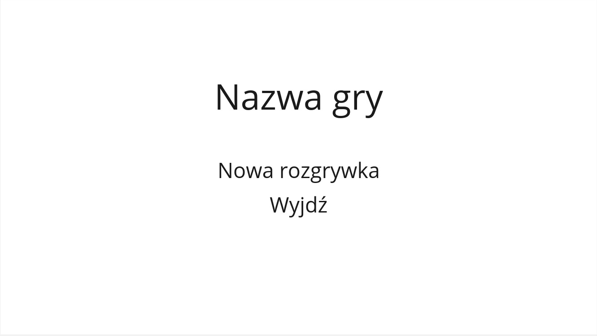

=== Tworzenie nowej rozgrywki

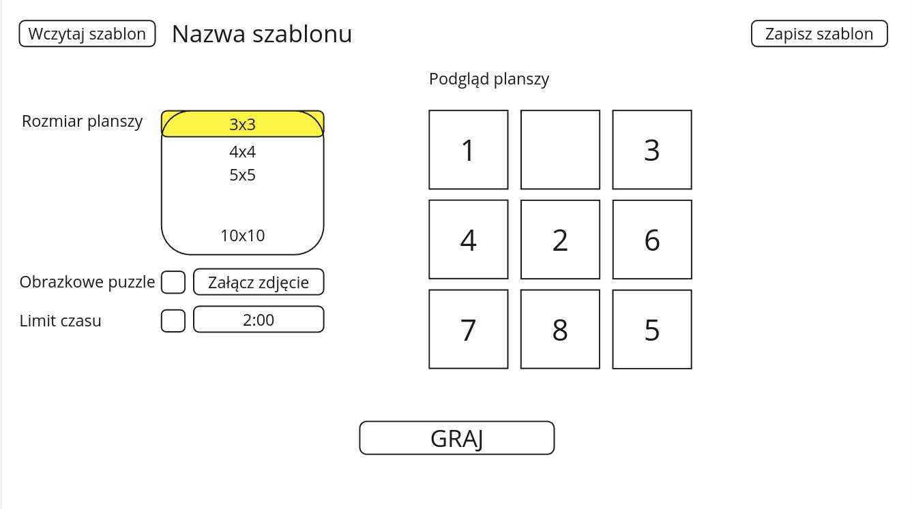

=== Rozgrywka

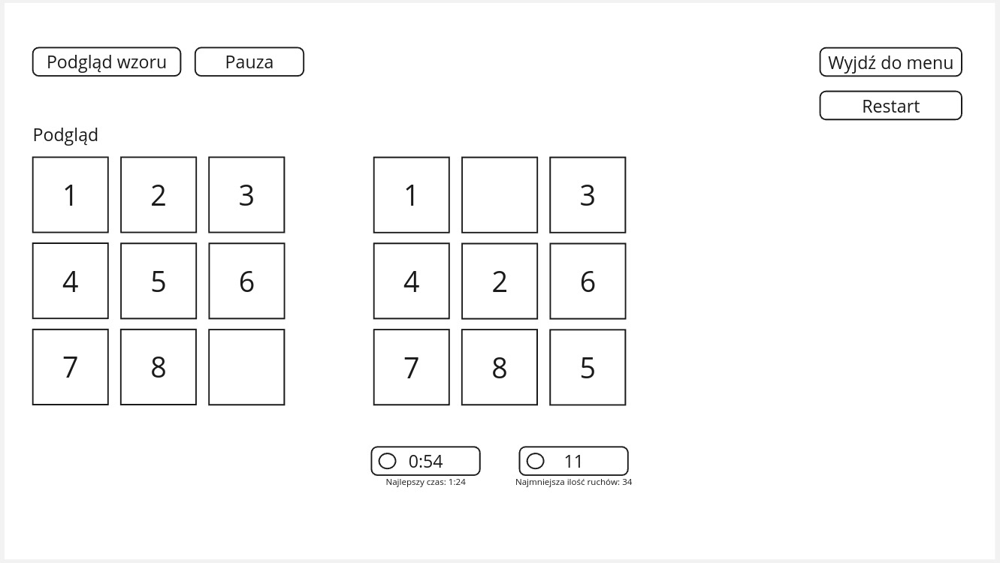

=== Koniec gry

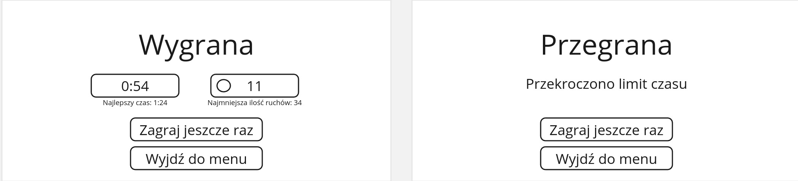

<<<

== Diagramy klas

=== Diagram zależności dla ekranu głównego

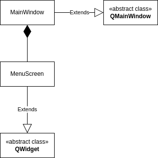

<<<

=== Diagram klas dla ekranu głównego

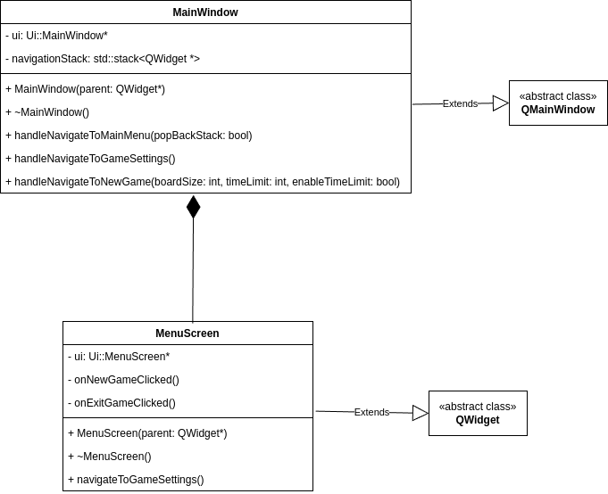

* `MainWindow` - jest to klasa-kontener, która zawiera logikę nawigacji opartą o stos.
Klasa ta przechwytuje i obsługuje sygnały, które wysyłają widoki-dzieci w celu nawigacji.
* `MenuScreen` - klasa reprezentująca ekran główny.
W tym przypadku *wyjątkowo* nie ma odpowiadającego `ViewModelu` ponieważ ten ekran jest skrajnie prosty.

<<<

=== Diagram zależności dla ekranu tworzenia nowej gry

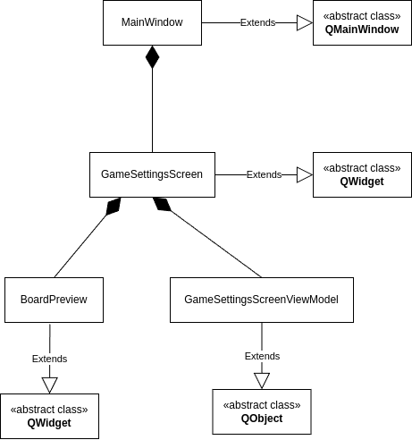

<<<

=== Diagram klas dla ekranu tworzenia nowej gry

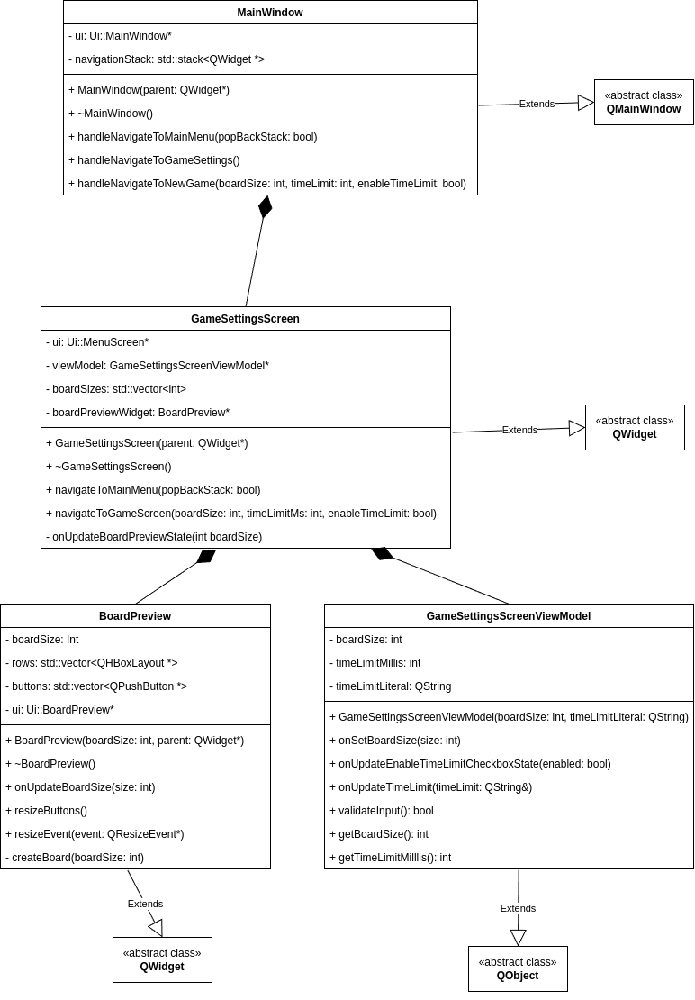

* `MainWindow` - klasa kontener działająca tak jak opisano w <<Diagram klas dla ekranu głównego, tym akapicie>>.
* `GameSettingsScreen` - klasa reprezentująca ekran tworzenia nowej gry.
Odpowiedzialnością tej klasy jest renderowanie ui oraz przechwytywanie interakcji użytkownika, która jest przekazywana do `GameSettingsScreenViewModel`.
Klasa ta też jest odpowiedzialna za wysyłanie sygnałów do `MainWindow`, które oznaczają nawigację między ekranami.
* `BoardPreview` - customowy widget, który reprezentuje podgląd planszy podczas tworzenia nowej rozgrywki.
Jego zadaniem jest pokazać użytkownikowi, jak będzie wyglądała plansza, z którą się zmierzy.
Odpowiedzialnością tej klasy jest to, aby poprawnie wyświetlała planszę oraz poprawnie się skalowała.
* `GameSettingsScreenViewModel` - odpowiada za utrzymywanie aktualnego stanu oraz wysyłanie sygnałów do `GameSettingsScreen` w przypadku, gdy ekran powinien się przerenderować na skutek zmiany stanu.
Dodatkowo view model validuje czas wpisany w polu do ustawiania limitu.

<<<

=== Diagram zależności dla ekranu gry

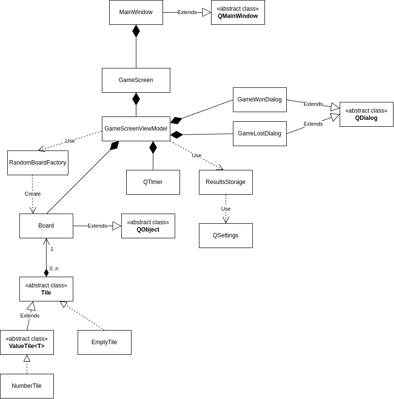

<<<

=== Diagram klas dla ekranu gry

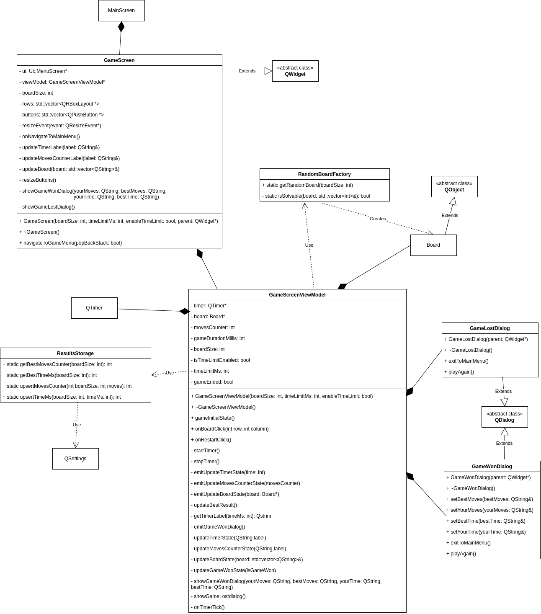

* `GameScreen` - reprezentuje ekran gry.
Odpowiada za poprawne renderowanie planszy, liczby ruchów, czasu; przechwytuje interakcje użytkownika i przekazuje je do `GameScreenViewModel`.
Odpowiada za wysyłanie sygnałów do `MainScreen` w celu nawigowania.
Wyświetla dialogi w przypadku wygranej/przegranej.
* `GameScreenViewModel` - odpowiada za zarządzanie stanem oraz obsługę interakcji użytkownika.
Przechowuje stan planszy, zarządza licznikiem czasu, sprawdza warunek zwycięstwa, zleca wyświetlenie dialogów.
Uaktualnia i porównuje najlepszy wynik dla konkretnego rozmiaru planszy.
* `RandomBoardFactory` - odpowiada za tworzenie losowej planszy dla podanego rozmiaru
* `Board` - klasa reprezentująca planszę.
Jest opisana szerzej w dalszej części dokumentu
* `GameWonDialog` - klasa reprezentująca dialog pojawiający się w momencie wygranej.
Pokazuje użytkownikowi jego wynik w porównaniu do najlepszego.
* `GameLostDialog` - klasa reprezentująca dialog pojawiający się w trybie walki z czasem, gdy użytkownik nie zdąży rozwiązać planszy przed upływem czasu.
* `ResultStorage` - klasa pozwalająca na pobieranie i zapis najlepszych wyników dla konkretnego rozmiaru planszy.

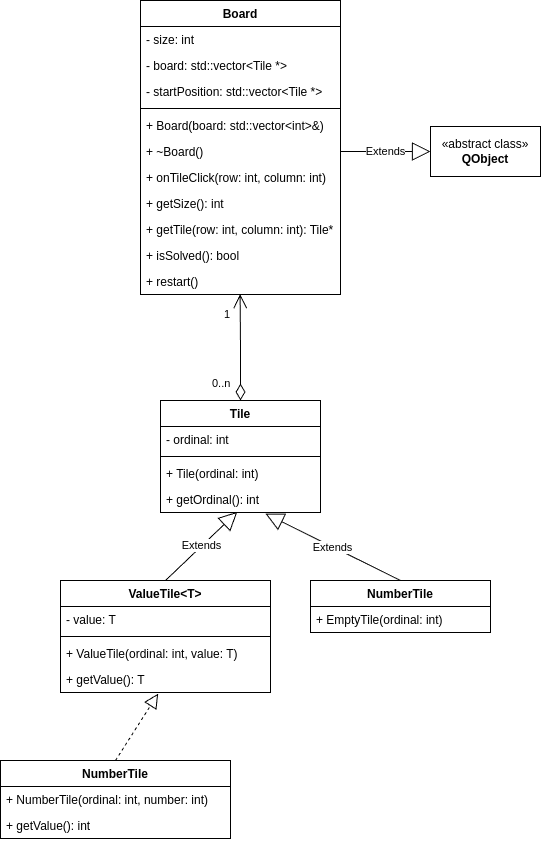

* `Board` - klasa reprezentująca planszę.
Odpowiada za poprawne przestawianie elementów na planszy, pozwala na przywrócenie planszy do stanu początkowego.
Przechowuje stan planszy.
* `Tile` - klasa reprezentująca abstrakcyjny typ puzla.
Zawiera pole oznaczające indeks kafelka w planszy.
* `ValueTile<T>` - klasa reprezentująca abstrakcyjny typ puzla, który może poza indeksem przechowywać wartość, np. liczbową, literową itd.
* `NumberTile` - klasa reprezentująca kafelek, który zawiera wartość liczbową.
Jest to kafelek wykorzystywany w klasycznej wersji gry, gdzie kafelki są ponumerowane od 1 do n^2 - 1, gdzie n to rozmiar planszy.
* `EmptyTile` - klasa reprezentująca pusty kafelek.
Występuje na każdej planszy.

